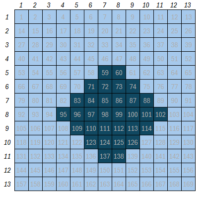

# scan-statistics

We start with a map made up of square regions, as follows

where, for each coordinate $(x,y)$, we have a square with a number inside, representing the region's index. Regions filled with a darker color represent a cluster of interest.

Normally we do not know which regions form a cluster, which is why we need statistical techniques to detect them.